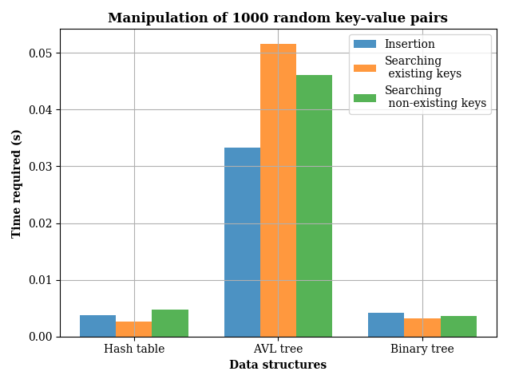
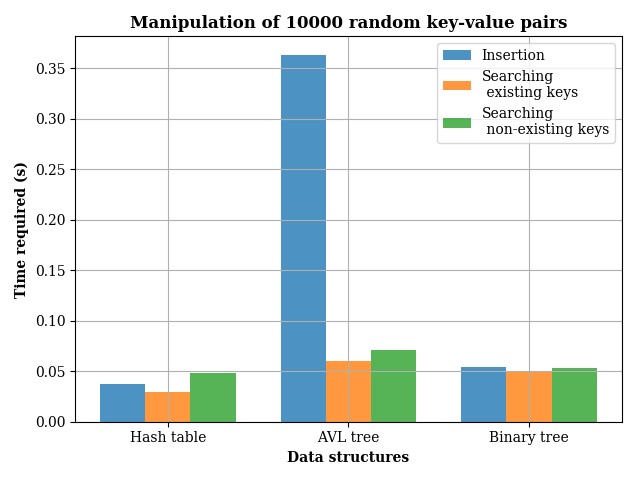
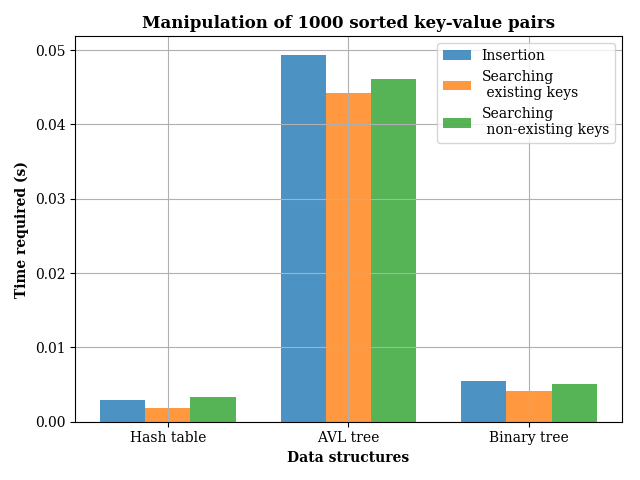
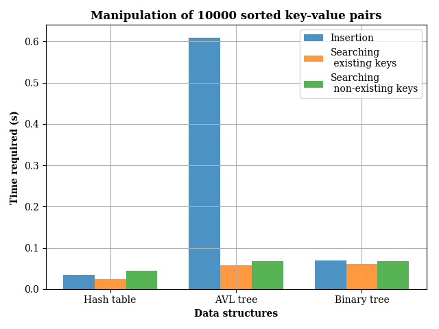

# Trees
[](https://travis-ci.com/cu-swe4s-fall-2019/trees-wehs7661)
# Description
This is a repository for Assignment 9 of the course Software Engineering for Scientists (CSCI 7000) at CU Boulder, which includes the following files:
- `insert_key_value_pairs.py`: The main program of this repository, which is for benchmarking different sizes of datasets extracted either from `rand.txt` or `sorted.txt` using three different data structures, including hash tables, AVL trees and binary trees.
- `gen_data.py`: A Python code for generating `rand.txt` and `sorted.py`.
- `rand.txt` and `sorted.txt`: text files containing 10000 key-value pairs, either unsorted (random) or sorted.
- `binary_tree.py`: A Python library for methods of a binary tree.
- `avl.py`: A Python library for methods of a AVL tree. 
- `test_trees.py`: A Python code for the unit tests of `binary_tree.py` and `avl.py`.
- `.gitmodules` and `hash-tables-wehs7661 @ 8c723f`: Submodule added from `hash-tables-wehs7661`, the repository of Assignment 6`.

## Installation
All the Python scripts are written in Python 3 and the packages required to run the codes include: `argparse`, `sys`, `matplotlib`, `time`, `os`, `random`, `unittest`, `string`, and `numpy`.

## Usage
### 1. Generation of the datasets
To generate the datasets `rand.txt` and `sorted.txt`, simply run the command `python gen_data.py`.

### 2. Execution of the main program
To run `insert_key_value_pair.py`, run 
```
python insert_key_value_pairs.py -d [data_structure] -i [datatest] -n [number_pairs]
```

### 3. Unit test
To run the unit tests for both `binary_tree.py` and `avl.py`, simply run `python test_trees.py`

### 4. Functional test
To run the functional tests for both `gen_data.py` and `insert_key_value_pairs.py`, simply run `test_trees.sh`

## Benchmarking results
To compare different data structures, we timed the time of different data manipulations, including insersion of keys, search of existing keys, search of non-existing keys. Results are shown below.
### 1. Random key-value pairs
  <br/>
As shown in the figures below, for the dataset of random key-value pairs, hash tables are much more efficient than the tree strcutres, including AVL trees and binary trees, in terms of the time required for all kinds of data manipulations, no matter how large is the dataset. What is kind of surprising is that the AVL trees did not perform better than the binary trees. This might be attibutable to non-optimized code or the size of the dataset, since in the right figure, it is also shown that the difference between the two different data structures is smaller for larger datasets. That is, for a even larger datasets, AVL trees should be more efficient than the binary trees. Another thing that is noteworthy is that the insertion time is much longer than the time required by searching keys. The possible reason is that in AVL trees, it is required to calculate and update the height and the balance factor for each node. However, once an AVL tree is created, its adavantage over a binary tree would be more obvious for the maniplation of a very large dataset.

### 2. Sorted key-value pairs
  <br/>
Basically, the same phenomenon could be observed in the results shown below, which are the times for different data manipulation on sorted key-value pairs. What's interseting is that the AVL tree is slight more efficient in search either existing and non-existing keys. This is because that for sorted key-value pairs, the binary tree could be very unbalanced, which make searching linear rather than binary. As the dataset gets larger,the difference should be even larger as well. (Also, searching non-existing keys is always more time-consuming compared with the existing keys, since a comprehensive search is requried to make sure that a key does not exist.)

## Changes made upon the starter code of Assignment 9
## Basic requirement
- Developed the insersion method, searching method and printing method for the binary tree structure in `binary_tree.py`.
- Developed unit tests in `test_trees.py` corresponding to the methods used in the `binar_tree.py`.
- Devloped a Python code `gen_data.py` for generating the datasets `rand.txt` and `sorted.txt`.
- Developed `insert_key_value_pairs.py`, which enable experiments of benchmarking on different datasets/data structures. 
- Developed functional tests `test_trees.py` for both `insert_key_value_pairs.py` and `gen_data.py`.
- Improved the codes to make them conform to PEP8 coding style.
- Modified `.travis.yml` to pass TravisCI.

## Extra credits
- Developed `avl.py` to implement the AVL tree structure and its corresponding unit tests.
- Performed additional experiemnts based on the AVL trees.


